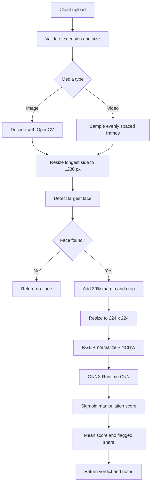

# ByteSense — Detailed Technical Guide

## 1. Processing flow



## 2. Data representation

| Stage | Source data | Operation | Output data |
|---:|---|---|---|
| 1 | Multipart `file` | Validate filename, extension, and upload size | Accepted media |
| 2 | Image bytes | `cv2.imdecode` | BGR image |
| 2 | Video path | `VideoCapture` and frame sampling | BGR frames |
| 3 | BGR image/frame | Limit longest side to `1280` pixels | Resized frame |
| 4 | Resized frame | Haar-cascade face detection | Largest `(x, y, w, h)` box |
| 5 | Face box | Add `30%` context margin and pad edges | Face crop |
| 6 | Face crop | RGB conversion, scaling, normalization | NCHW float32 tensor |
| 7 | Tensor | ONNX Runtime CPU inference | One logit per crop |
| 8 | Logit | Sigmoid transformation | Score in `[0, 1]` |
| 9 | Frame scores | Mean and threshold comparison | JSON response |

## 3. Input and output tables

### Input formats

| Category | Extensions | Default behavior | Limit |
|---|---|---|---|
| Image | `.jpg`, `.jpeg`, `.png`, `.webp`, `.bmp` | Analyze one image | `MAX_UPLOAD_MB=200` |
| Video | `.mp4`, `.mov`, `.avi`, `.webm`, `.mkv` | Sample evenly spaced frames | `frames=20`, maximum `300` |

### Response fields

| Field | Type | Example | Description |
|---|---|---|---|
| `media_type` | string | `video` | `image` or `video` |
| `frames_sampled` | integer | `20` | Frames examined |
| `frames_with_face` | integer | `18` | Frames with a detected face |
| `verdict` | string | `inconclusive` | Final classification |
| `score` | number/null | `0.57` | Mean manipulation score |
| `flagged_share` | number/null | `0.444` | Share of face frames at/above threshold |
| `frames` | array | `[...]` | Per-frame scores and face previews |
| `notes` | array | `[...]` | Quality and uncertainty messages |

## 4. Verdict visualization

The default threshold is `0.50` and the uncertainty band is `±0.15`. A model metadata file beside the ONNX model can override these values.

```text
0.00                 0.35             0.50             0.65                 1.00
|----------------------|==================|----------------------|
     LIKELY REAL          INCONCLUSIVE          LIKELY FAKE
       green                 amber                 red
```

| Score condition | Result | Display color |
|---|---|---|
| `score <= threshold - band` | `likely_real` | 🟩 Green |
| `threshold - band < score < threshold + band` | `inconclusive` | 🟨 Amber |
| `score >= threshold + band` | `likely_fake` | 🟥 Red |
| No face crop available | `no_face` | ⬜ Gray |

## 5. Project structure

| File | Main responsibility | Important data produced/used |
|---|---|---|
| `app.py` | Flask routes and uploads | HTTP/JSON request and response |
| `media.py` | Image decode and video sampling | BGR frames, timestamps, frame indexes |
| `faces.py` | Face detection and crop creation | Face box and `224 × 224` crop |
| `detector.py` | Preprocessing, inference, aggregation | Scores, verdict, notes, thumbnails |
| `requirement.txt` | Runtime dependencies | Flask, OpenCV, NumPy, ONNX Runtime, Gunicorn |
| `models/model.onnx` | Inference model | CNN logits per face crop |
| `models/model.json` | Optional model metadata | Threshold, normalization, metrics |

## 6. API examples

```bash
# Health check
curl http://127.0.0.1:10000/health

# Image analysis
curl -X POST \
  -F "file=@sample.jpg" \
  http://127.0.0.1:10000/analyze

# Video analysis with 20 sampled frames
curl -X POST \
  -F "file=@sample.mp4" \
  -F "frames=20" \
  http://127.0.0.1:10000/analyze
```

## 7. Configuration

| Environment variable | Default | Used by | Description |
|---|---|---|---|
| `MODEL_PATH` | `models/model.onnx` | `app.py`, `detector.py` | Model file path |
| `PORT` | `10000` | `app.py` | Port for direct execution |
| `MAX_UPLOAD_MB` | `200` | `app.py` | Maximum request size |

## 8. Limitations

- Haar-cascade detection may miss side-on, small, blurry, or occluded faces.
- A video result is only as reliable as the sampled frames with detected faces.
- A score near the middle is intentionally reported as `inconclusive`.
- The model score must not be treated as a calibrated probability.
