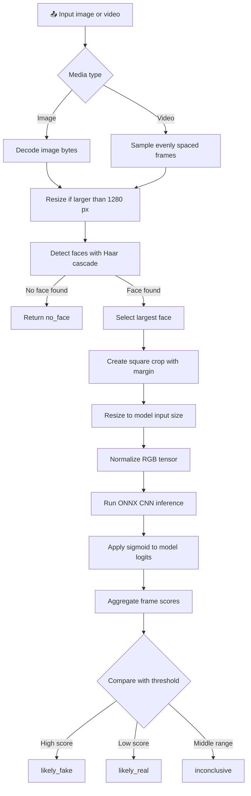

# 🎭 Deepfake Detection

> A lightweight, CPU-friendly deepfake detection pipeline for analyzing images and videos with **OpenCV** and **ONNX Runtime**.

[](https://www.python.org/) [](https://opencv.org/) [](https://onnxruntime.ai/)

---

## 📌 Overview

This project detects potential face manipulation by sampling media, locating the largest face, running an ONNX CNN model on the extracted face, and aggregating the frame-level scores into a final verdict.

> ⚠️ **Important:** The returned score is a model manipulation score, not a calibrated probability. Results should be treated as an indication rather than definitive proof.

---

## ✨ Features

| Feature | Description |
|---|---|
| 🖼️ Image analysis | Decode and analyze supported image formats |
| 🎞️ Video analysis | Sample evenly spaced video frames |
| 🙂 Face detection | Detect the largest frontal face with OpenCV Haar cascades |
| ✂️ Face cropping | Create square crops with context margin and border padding |
| 🧠 ONNX inference | Run CNN inference with the CPU execution provider |
| 📊 Score aggregation | Combine frame scores into one media-level verdict |
| 📝 Diagnostics | Return per-frame scores, thumbnails, and reliability notes |
| 💾 Memory-conscious processing | Downscale large frames to a maximum side of 1280 px |

---

## 🔄 Processing Pipeline



### Decision logic

With the default threshold and uncertainty band:

| Condition | Verdict | Meaning |
|---|---|---|
| `score >= threshold + band` | `likely_fake` | Evidence leans toward manipulation |
| `score <= threshold - band` | `likely_real` | Evidence leans toward authentic media |
| Otherwise | `inconclusive` | The model does not have a clear signal |
| No detectable face | `no_face` | Analysis could not be performed |

The default values are `threshold = 0.5` and `uncertain_band = 0.15`, unless overridden by model metadata.

---

## 🗂️ Project Structure

```text
Deepfake-detection/
├── README.md       # Project documentation
├── detector.py     # ONNX loading, preprocessing, scoring, and verdicts
├── faces.py        # Face detection and face-crop preparation
└── media.py        # Image decoding and video frame sampling
```

| File | Responsibility |
|---|---|
| [`detector.py`](detector.py) | Loads the ONNX model, prepares crops, calculates scores, and produces verdicts |
| [`faces.py`](faces.py) | Detects the largest face and creates a padded square crop |
| [`media.py`](media.py) | Decodes images and yields downscaled video frames |
| `README.md` | Usage, architecture, limitations, and output documentation |

---

## 🧰 Requirements

- Python 3.8 or newer
- NumPy
- OpenCV
- ONNX Runtime
- A compatible ONNX model file

Install the Python dependencies:

```bash
pip install numpy opencv-python onnxruntime
```

### Model files

The detector expects an ONNX model. An optional metadata file can be placed beside it using the same filename:

```text
models/
├── model.onnx
└── model.json   # Optional
```

The optional JSON metadata may define:

| Metadata field | Purpose | Default |
|---|---|---|
| `arch` | Model architecture name | `unknown` |
| `input_size` | Width and height expected by the model | `224` |
| `mean` | RGB normalization means | `[0.485, 0.456, 0.406]` |
| `std` | RGB normalization standard deviations | `[0.229, 0.224, 0.225]` |
| `threshold` | Fake-score decision threshold | `0.5` |
| `uncertain_band` | Margin around the threshold | `0.15` |
| `trained_on` | Training data description | `[]` |
| `metrics` | Evaluation metrics | `{}` |

---

## 🚀 Usage

### 1. Load the detector

```python
from detector import Detector

detector = Detector("models/model.onnx")

if not detector.available:
    print(detector.info()["error"])
else:
    print(detector.info())
```

### 2. Analyze an image

```python
import cv2
from detector import Detector

model = Detector("models/model.onnx")
image = cv2.imread("sample.jpg")

if image is None:
    raise ValueError("Could not read sample.jpg")

result = model.analyze([(0, None, image)], "image")

print("Verdict:", result["verdict"])
print("Score:", result["score"])
print("Notes:", result["notes"])
```

### 3. Analyze a video

```python
from detector import Detector
from media import iter_video_frames

model = Detector("models/model.onnx")
frames = iter_video_frames("sample.mp4", n=20)
result = model.analyze(frames, "video")

print("Verdict:", result["verdict"])
print("Average score:", result["score"])
print("Flagged share:", result["flagged_share"])
```

### 4. Decode an uploaded image and sample video frames

```python
from media import decode_image, iter_video_frames

with open("sample.jpg", "rb") as file:
    image = decode_image(file.read())

sampled_frames = list(iter_video_frames("sample.mp4", n=10))
```

---

## 📦 Output Format

`Detector.analyze()` returns a dictionary similar to the following:

```python
{
    "media_type": "video",
    "frames_sampled": 20,
    "frames_with_face": 15,
    "verdict": "likely_fake",
    "score": 0.83,
    "flagged_share": 0.7,
    "frames": [
        {
            "index": 0,
            "time": 0.0,
            "face_px": 180,
            "score": 0.91,
            "face": "data:image/jpeg;base64,..."
        }
    ],
    "notes": []
}
```

### Output fields

| Field | Type | Description |
|---|---|---|
| `media_type` | `str` | Input type, such as `image` or `video` |
| `frames_sampled` | `int` | Number of frames inspected |
| `frames_with_face` | `int` | Number of frames containing a detectable face |
| `verdict` | `str` | Final classification result |
| `score` | `float \| None` | Mean manipulation score across detected faces |
| `flagged_share` | `float \| None` | Share of face crops at or above the threshold |
| `frames` | `list` | Per-frame scores and face thumbnails |
| `notes` | `list[str]` | Warnings and reliability observations |

---

## 🧪 Score Interpretation

```text
0.00 ├──────────────┬──────────────────┬──────────────┤ 1.00
     likely real   inconclusive       likely fake
                  0.35      0.65
```

- **Lower scores** indicate that the model sees fewer manipulation signals.
- **Higher scores** indicate stronger manipulation signals.
- **Scores between 0.35 and 0.65** are treated as inconclusive with the default settings.
- A video result is based on the average score across sampled frames, not a single frame.

---

## ⚠️ Limitations and Reliability

| Limitation | Effect |
|---|---|
| Haar cascade detector | Works best for clear, frontal faces; side-on faces may be missed |
| Small faces | Detection and scoring become less reliable below roughly 80–100 px |
| Blurry or compressed media | Can reduce model confidence |
| Few usable video frames | Produces a weaker video result |
| Conflicting frame scores | May indicate uncertainty or changing visual conditions |
| Uncalibrated score | A score is not a verified probability of manipulation |
| Missing model file | The detector remains unavailable and reports an error |

For best results, use media with a clear, front-facing face that occupies a reasonable portion of the frame.

---

## 🛠️ Possible Improvements

- Replace the Haar cascade with a stronger detector such as YuNet.
- Add automated tests for image decoding, face cropping, and verdict boundaries.
- Add a command-line interface or web interface.
- Support multiple faces per frame instead of only the largest face.
- Calibrate scores against a representative validation dataset.
- Add model and dataset documentation with evaluation metrics.

---

## 📄 License

This repository does not currently include a license file. Add a license before distributing or reusing the project publicly.

---

<p align="center">
  Built for experimentation with face-based media authenticity analysis.
</p>
