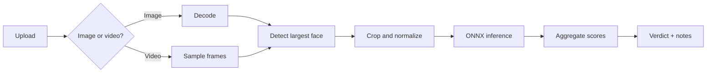

# ByteSense

> **AI-based deepfake detection for images and videos**

ByteSense is a lightweight Flask API that detects a face, scores it with an ONNX model, and returns an easy-to-read media verdict.

[](https://www.python.org/) [](https://flask.palletsprojects.com/) [](https://onnxruntime.ai/)

## System overview



## Quick facts

<table>
  <tr>
    <th>🟦 Input</th>
    <th>🟩 Processing</th>
    <th>🟪 Output</th>
  </tr>
  <tr>
    <td>Images or videos</td>
    <td>OpenCV + Haar cascade + ONNX Runtime</td>
    <td>Score, verdict, frame details, and notes</td>
  </tr>
</table>

## Supported media

<table>
  <tr>
    <th>Type</th>
    <th>Formats</th>
    <th>How it is processed</th>
  </tr>
  <tr>
    <td><strong><span style="color:#2563eb">Image</span></strong></td>
    <td><code>.jpg</code> <code>.jpeg</code> <code>.png</code> <code>.webp</code> <code>.bmp</code></td>
    <td>One decoded image is analyzed</td>
  </tr>
  <tr>
    <td><strong><span style="color:#7c3aed">Video</span></strong></td>
    <td><code>.mp4</code> <code>.mov</code> <code>.avi</code> <code>.webm</code> <code>.mkv</code></td>
    <td>Up to the requested number of frames are sampled</td>
  </tr>
</table>

## Verdict guide

<table>
  <tr>
    <th>Verdict</th>
    <th>Meaning</th>
  </tr>
  <tr>
    <td><strong><span style="color:#dc2626">likely_fake</span></strong></td>
    <td>Aggregate score is above the upper decision boundary</td>
  </tr>
  <tr>
    <td><strong><span style="color:#d97706">inconclusive</span></strong></td>
    <td>Score is inside the uncertainty band</td>
  </tr>
  <tr>
    <td><strong><span style="color:#16a34a">likely_real</span></strong></td>
    <td>Aggregate score is below the lower decision boundary</td>
  </tr>
  <tr>
    <td><strong><span style="color:#64748b">no_face</span></strong></td>
    <td>No usable face was detected</td>
  </tr>
</table>

> **Important:** The output is a model score, not a calibrated probability or definitive proof.

## Quick start

```bash
python -m pip install -r requirements.txt
python app.py
```

Upload an image:

```bash
curl -X POST -F "file=@sample.jpg" http://127.0.0.1:10000/analyze
```

Upload a video and request 20 sampled frames:

```bash
curl -X POST -F "file=@sample.mp4" -F "frames=20" http://127.0.0.1:10000/analyze
```

## API endpoints

| Method | Endpoint | Purpose |
|:---:|---|---|
| `GET` | `/` | Service and detector metadata |
| `GET` | `/health` | Health status and model availability |
| `POST` | `/analyze` | Analyze an image or video uploaded as `file` |

## Configuration

| Variable | Default | Purpose |
|---|---|---|
| `MODEL_PATH` | `models/model.onnx` | ONNX model location |
| `PORT` | `10000` | Local application port |
| `MAX_UPLOAD_MB` | `200` | Maximum upload size |


